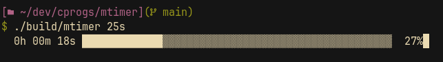

# mtimer
A simple CLI countdown timer written in C.

## Usage
- Build the project (see [readme](../README.md#usage)), then
```sh
./build/mtimer 3h 45m 30s
```
- Help
```sh
./build/mtimer --help
```

## Screenshots

